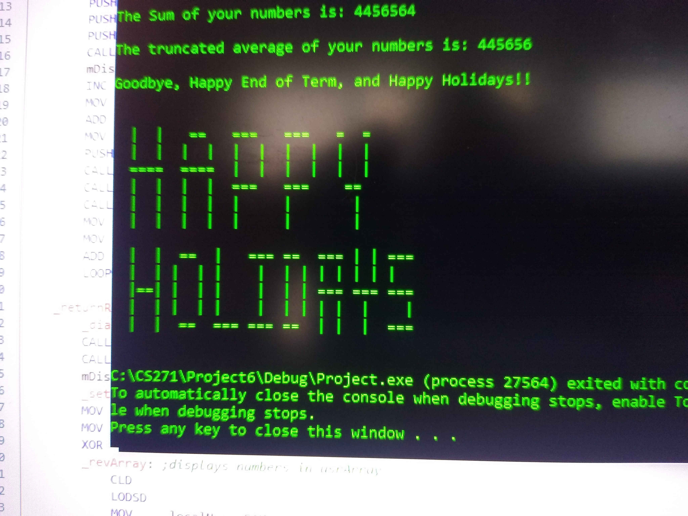

# 🖥️ MASM Low-Level I/O Program
### x86 Assembly Language | CS271 Computer Architecture & Assembly Language | Oregon State University

> **Score: 51/50** — Full marks plus extra credit 🎉

A 533-line x86 MASM Assembly program demonstrating mastery of low-level I/O procedures, string primitive instructions, macro design, and stack-based parameter passing — the portfolio capstone project for OSU's Computer Architecture course.

---

## 📸 Program Output



> *Yes, that ASCII art "HAPPY HOLIDAYS" is rendered entirely in raw byte values — because why not?* 😄

---

## ✨ What It Does

The program collects 10 signed 32-bit integers from the user, validates each one, stores them in an array, and displays:

- The list of entered numbers
- Their sum
- Their truncated average
- A running subtotal after each entry *(extra credit)*
- Line numbers for each prompt *(extra credit)*

---

## 🛠️ Technical Highlights

### Custom Macros
- **`mGetString`** — displays a prompt and reads user keyboard input into memory using `ReadString`, with `PUSHAD/POPAD` register preservation
- **`mDisplayString`** — prints a string at a given memory address using `WriteString`

### Custom Procedures
- **`ReadVal`** — converts user string input to a signed 32-bit integer (`SDWORD`) using `LODSB` string primitives, with full input validation
- **`WriteVal`** — converts a signed 32-bit integer back to an ASCII string using `STOSB` string primitives, then displays it
- **`Convert`** — sub-procedure of `ReadVal` handling the place-value arithmetic of ASCII-to-integer conversion

### Input Validation
- Rejects non-numeric characters
- Handles `+` and `-` sign prefixes
- Detects and rejects numbers too large for a 32-bit register using overflow detection (`JO`)
- Re-prompts user on any invalid input including empty input

### Low-Level Requirements Met
- ✅ `LODSB` and `STOSB` used for all string primitive operations
- ✅ All parameters passed on the runtime stack using STDCALL calling convention
- ✅ All registers saved and restored by called procedures and macros
- ✅ Stack cleaned up by called procedures (`RET n`)
- ✅ No global variable references outside of `main`
- ✅ Register Indirect addressing for array elements
- ✅ Base+Offset addressing for stack parameters
- ✅ Local variables used appropriately via `LOCAL` directive

### Extra Credit Implemented
- **Line numbering** — each user prompt is numbered sequentially using `WriteVal`
- **Running subtotal** — displays a running total after each valid entry using `WriteVal`

---

## 📖 Program Flow

```
main
├── mDisplayString (intro, directions)
├── Loop 10x:
│   ├── WriteVal (line number)
│   ├── ReadVal
│   │   ├── mGetString (get user input)
│   │   ├── Validate input character by character (LODSB)
│   │   └── Convert (ASCII → SDWORD)
│   └── WriteVal (running total)
├── Display array (WriteVal per element)
├── Display sum (WriteVal)
├── Display average (WriteVal)
└── ASCII art farewell 🎄
```

---

## 🎓 What I Learned

This project pushed me to think at the hardware level — every byte matters, every register has a purpose, and there is no abstraction to hide behind. Key takeaways:

- **String primitives** — `LODSB`/`STOSB` are elegant tools once you understand the direction flag and how ESI/EDI advance automatically
- **Stack discipline** — managing the runtime stack manually, including cleaning up with `RET n`, gave me a deep appreciation for what high-level languages handle automatically
- **Overflow detection** — using `JO` to catch 32-bit register overflow during conversion was one of the most satisfying debugging moments of the project
- **String reversal** — converting a number to string requires building digits in reverse order, then reversing the string — a deceptively tricky problem at the byte level

---

## 🚀 Running the Program

### Requirements
- Windows
- Visual Studio with MASM support
- Irvine32 library

### Setup
1. Clone the repo
2. Open in Visual Studio
3. Ensure Irvine32.inc is configured in your include path
4. Build and run `Proj6_wiricka.asm`

---

## 👩‍💻 Author

**Aimee Wirick**
Oregon State University — B.S. Computer Science, Expected June 2026
[LinkedIn](https://www.linkedin.com/in/aimee-wirick-170765122) • [AimeeWirick.com](https://AimeeWirick.com) • [GitHub](https://github.com/aimeewirick)
